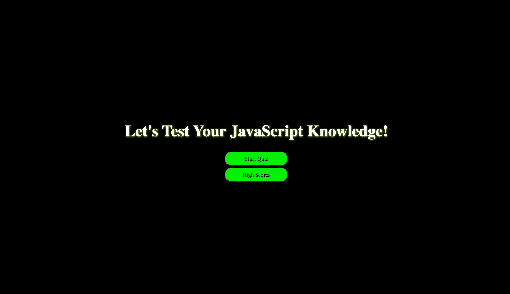

# JavaScript Quiz
- Here I have a quiz that I made that will you ask you questions about JavaScript
- I created everything from scratch which is why it doesn't work totally correct xD
- What I learned while making this is how to set an array, have the different properties display after an event through multiple functions.

## Usage 
- First - Deploy the webpage from here https://jonathanguhl.github.io/JavaQuiz/
- Second - You can click the "Start Quiz" button or "Show Scores" button. You won't see any scores at the beginning though because it's pulling from local storage.
- Third - After you've completed the quiz you'll be asked to submit your initials so it can log your initials and score locally
- Four - After seeing your score, you can choose to either retry the quiz, or clear the local storage which will clear the scores.
- When deployed the browser should display this
